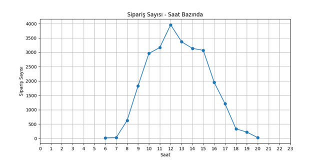

# 🛒 E-Ticaret Veri Analizi Projesi

Bu projede, Kaggle'dan alınan Online Retail verisi kullanılarak satış verileri analiz edilmiştir.

## 🚀 Kullanılan Araçlar
- Python
- Pandas
- NumPy
- Matplotlib
- Jupyter Notebook

## 📊 Yapılan Analizler
- En çok satılan ürünler
- Saatlere göre sipariş yoğunluğu
- Ürünlerin toplam getirisi
- Faturalarda en çok geçen ülkeler

## 🖼️ Örnek Grafik

## 📁 Dosyalar
- `OnlineRetailAnalysis.ipynb` – Tüm analizleri içeren Jupyter Notebook
